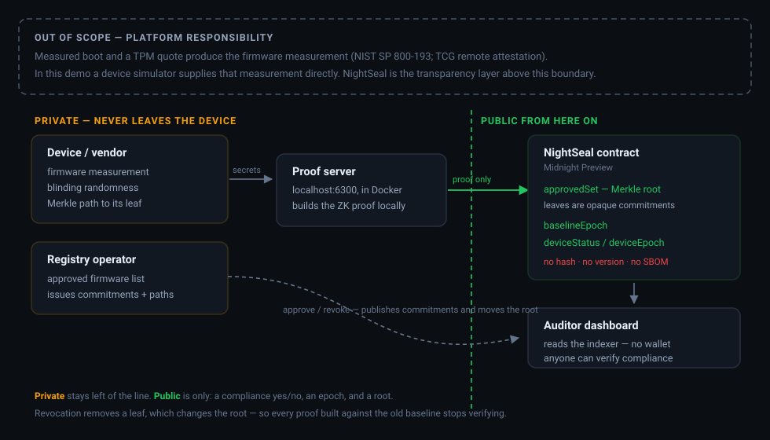

# NightSeal

**Your router's manufacturer must prove its firmware is clean — without publishing a map of its insides for attackers.**

NightSeal makes firmware compliance a **revocable cryptographic capability** on [Midnight](https://midnight.network). A registered device proves in zero knowledge that its hidden firmware *and every component bound into it* remain in two current approved sets. When a component CVE lands, affected firmware loses the ability to prove compliance—even though the chain never learns the firmware version, component graph, SBOM, or which builds were affected.

> **The memorable mechanism:** revoke one hidden component; keep every firmware leaf untouched; only firmware that secretly depended on that component can no longer prove.

---

## Deployed contract

<!-- DEPLOYMENT:START -->
| | |
|---|---|
| **Network** | Midnight **Preview** |
| **Contract address** | `160c6bfcd360c8806bea5d45740f45d80930482038f57e55b72f6d002bb0ef6e` |
| **Explorer** | [preview.midnightexplorer.com/contract/160c6bfc…](https://preview.midnightexplorer.com/contract/160c6bfcd360c8806bea5d45740f45d80930482038f57e55b72f6d002bb0ef6e) |
| **Live auditor dashboard** | [nightseal.vercel.app](https://nightseal.vercel.app) — read-only, no wallet needed: the privacy claim, clickable |
<!-- DEPLOYMENT:END -->

---

## What is public, what is private, what is proven

| | |
|---|---|
| **Public, on-chain** | device id → registered identity commitment + compliance status + attested policy epoch; current firmware/component Merkle roots; opaque commitment leaves |
| **Private, never on-chain** | device secret, firmware measurement, component manifest and measurements, blinding randomness, Merkle paths, exact version, SBOM/HBOM, suppliers |
| **Proven in zero knowledge** | *"I control this registered device; its hidden firmware is current; and every hidden component bound into it is current"* |

The point is the middle row. A regulator can demand proof of firmware provenance and get a verifiable answer; an attacker reading the same chain learns nothing about what is running on the device.

---

## The three-beat demo

1. **Pass.** A registered device attests through three simultaneous proof gates: device-secret ownership, current firmware membership, and current membership of all three privately bound components. The dashboard turns green; the explorer reveals none of those secrets.
2. **Revoke.** A CVE drops in one component. The operator removes that opaque component capability. The **component root moves while the firmware root stays unchanged**, and the policy epoch increments.
3. **Fail.** Both devices re-attest. The unaffected device goes green again. The secretly dependent device **cannot produce a valid proof at all**—its firmware leaf still exists, but one component path no longer does. It goes red; the chain sees the policy epoch move, but not which component, firmware, or dependency caused it.
4. **Rejected by consensus.** A proof built *before* the revocation—honest, valid, fully verifying—is submitted afterwards anyway. The ledger re-checks the roots recorded in its transcript against present state and **refuses the transaction itself**. The failure is a chain verdict, not an application decision.

The difference between beats 2 and 3 is produced by cryptography, not by application logic.

---

## Architecture



**The hardware root of trust is out of scope, by design.** A real deployment obtains the firmware measurement from measured boot and a TPM quote ([NIST SP 800-193](https://csrc.nist.gov/pubs/sp/800/193/final); TCG remote attestation). In this project a device simulator supplies that measurement directly. NightSeal's contribution is the privacy-preserving transparency layer *above* that boundary — the part that today either does not exist or requires publishing exactly the data you must not publish.

### How revocation actually works

NightSeal uses two Compact `MerkleTree<10, Bytes<32>>` capability sets whose leaves are commitments, never measurements:

- A component leaf commits to a private component measurement.
- A firmware leaf commits to its private measurement **and** a digest of exactly three private component commitments.
- `attest` opens the firmware commitment, proves its current membership, proves current membership of all three bound components, and proves knowledge of the secret committed against the public device id.

Approval, revocation, and cover rotation deliberately call the same `updateComponentLeaf(value, index)` circuit. Approval writes a real capability commitment; revocation writes fresh random bytes—an opaque tombstone for which nobody knows a valid opening. The chain sees the same public operation and argument shape in either case. Only the component root changes. Because the private manifest is bound into the firmware commitment, a prover cannot swap in a clean component without also changing its firmware leaf—and that new leaf is not approved. Firmware updates use the same operation-hiding pattern, preserving the original PASS → REVOKE → FAIL flow.

> **Three design decisions carry the product.** Plain `MerkleTree.checkRoot` accepts only the current root, so revocation destroys an old capability instead of marking it unsafe. Binding the private component manifest inside the firmware commitment makes that destruction cascade across a dependency graph the public never sees. Opaque tombstones make approval, revocation, and routine rotation indistinguishable at the contract-call level.

The hackathon circuit fixes manifests at three component slots so proof cost and deployment risk stay bounded. The complete candidate ranking and rejected alternatives are in [the innovation audit](docs/INNOVATION_AUDIT.md).

Both capability trees have depth 10: **1,024 firmware leaves and 1,024 component leaves** in this profile. Depth is a compile-time capacity knob; it changes circuit cost, not the protocol design.

---

## Beyond the tutorials

Midnight's official ZK Loan tutorial shares this skeleton — check something in zero knowledge, write a yes/no on-chain. NightSeal differs in the part that matters:

| | ZK Loan tutorial | NightSeal |
|---|---|---|
| Attestation | one-shot | **stateful, with an on-chain lifecycle** |
| Criteria | fixed at deployment | **revocable baseline the operator moves** |
| Identity | caller claim | **proof of the registered device-secret opening** |
| Policy graph | one predicate | **firmware capability + hidden component capabilities** |
| After a component CVE | n/a | **firmware root stays unchanged, but secretly dependent firmware loses proof power** |
| Failure mode | n/a | **an affected device provably cannot construct a passing proof** |

The full lifecycle—attest → CVE → root update → selective failed re-attestation → consensus-rejected replay—**has been executed on Preview**, with the firmware root verified byte-identical across the component revocation. Every transaction hash is in [docs/EVIDENCE.md](docs/EVIDENCE.md).

## Why this needs Midnight specifically

Firmware attestation has two requirements that are normally in direct conflict. Regulators ([CERT-In directions](https://www.cert-in.org.in/), [IEC 62443](https://www.iec.ch/cyber-security), [EN 303 645](https://www.etsi.org/deliver/etsi_en/303600_303699/303645/)) increasingly demand demonstrable firmware provenance. Meanwhile publishing firmware hashes and SBOMs hands attackers a targeting map and leaks competitive information about suppliers and release cadence.

A transparent chain forces you to choose. Midnight does not: firmware, component composition, device secret, and Merkle paths stay in local witnesses; the public ledger holds two policy roots, identity commitments, and compliance results; and the Compact circuit binds them atomically. The dependency-driven failure is publicly verifiable while the dependency graph stays private. A normal backend can hide that graph, but it cannot let strangers verify the result without trusting the backend.

---

## Run it

Prerequisites: Docker, Node 22+, and the [Compact toolchain](https://docs.midnight.network/getting-started/installation) (Linux or macOS — on Windows use WSL; there is no native Windows compiler build).

```bash
git clone https://github.com/Harshyadav442277/Midnight-hackathon.git nightseal && cd nightseal
npm install && npm run compact && npm run build
docker run -d -p 6300:6300 midnightntwrk/proof-server:8.1.0 midnight-proof-server -v
npm run cli -- address        # fund this address at the Preview faucet, then: npm run cli -- dust
npm run serve                 # dashboard + operator service on http://localhost:8787
```

Point the dashboard at the deployed registry above, or run `npm run cli -- deploy` to stand up your own.

**Verify the claims without deploying anything:**

```bash
npm test
```

Eleven tests cover the lifecycle and its adversarial edges: cross-device impersonation, component substitution, component-root replay, direct firmware revocation, and serialization checks proving device, firmware, component, and opening secrets never enter published state.

### Attack map

| Attack | Why it fails | Test evidence |
|---|---|---|
| Device A claims Device B's id | The proof must open B's registered identity commitment. | `does not let Device A's valid firmware proof authorize Device B` |
| Affected firmware swaps in a clean component | The exact private manifest digest is bound inside the approved firmware commitment. | `cannot swap in a clean component because the manifest is firmware-bound` |
| Pre-CVE proof/root is replayed | Plain `MerkleTree.checkRoot` accepts only the current root. | `invalidates the previous component root` |
| Rogue operator changes policy | Every update proves knowledge of the registered operator secret. | `refuses every policy or identity change from a non-operator` |
| Observer reads secrets from ledger state | Only domain-separated commitments and proof results are published. | `publishes neither identity secret, firmware, components, nor openings` |

Two devices on the same firmware cannot be clustered by an on-chain firmware value: device records contain only identity commitments, status, and epoch. Correlated failures after a policy update can still leak a likely shared dependency, which is disclosed below.

### CLI

| Command | What it does |
|---|---|
| `npm run cli -- deploy` | deploy the registry and publish the approved baseline |
| `npm run cli -- attest <device>` | a device proves its firmware is in the baseline |
| `npm run cli -- revoke-component <component>` | revoke one hidden component and cascade failure into dependent firmware — the flagship CVE moment |
| `npm run cli -- revoke <build>` | directly revoke a firmware build — preserves the original flow |
| `npm run cli -- replay <device> <component>` | prove an attestation, revoke the component, then submit the stale proof — the ledger rejects it |
| `npm run cli -- status` | print the public compliance state an auditor sees |

---

## Assumptions and limitations

Stated plainly, because a registry nobody can audit honestly is not worth building.

- **The hardware root of trust is mocked.** See the architecture note above. This is the single largest gap between this project and a deployable system.
- **The registry operator learns the firmware measurements.** It computes the commitments and issues the blinding factors, so NightSeal protects firmware data from the public chain and from attackers — not from the operator that approves builds. A production design would have vendors generate their own commitments.
- **No "device X failed" record is ever written to the ledger.** That would require proving *non*-membership, which this design deliberately refuses to do. A revoked device simply cannot build a valid proof, so its ordinary failure happens locally and the dashboard labels it as an attempt record rather than chain state. The on-chain evidence of revocation is the root change plus the device's now-stale epoch — and, when a proof built before the revocation is replayed, an outright transaction rejection by the ledger.
- **Compliance is epoch-relative.** Every device goes amber the moment the baseline moves, including unaffected ones — correct, since nobody has proved anything against the new root yet, but amber alone is not evidence of a vulnerability.
- **A single operator key** controls both capability sets and device enrollment; there is no multisig or governance.
- **Device identity is cryptographically bound, but hardware protection is mocked.** The proof requires the registered per-device secret, but the simulator stores it in local private state. Production would protect and enroll it with a TPM/secure element and device PKI.
- **Component manifests have three fixed slots.** This bounds the static hackathon circuit; it is not a production SBOM-size claim.
- **Demo fixtures are reproducible source data.** Their labels and relationships are intentionally visible in this repository. The privacy claim is that those values and relationships do not appear on-chain or in the public auditor API.
- **Operation type is hidden, not all timing correlation.** The two update circuits hide approval vs. tombstone revocation vs. cover rotation, but observers still see a root/epoch move and may correlate devices that do not return to green.
- **No browser wallet integration.** The auditor dashboard needs no wallet at all, which is the point; privileged actions go through a local operator service rather than Lace.

Full engineering ledger: [GAPS.md](GAPS.md) · design rationale and rejected alternatives: [ARCHITECTURE.md](ARCHITECTURE.md)

---

## Repository

| Path | |
|---|---|
| [`contract/src/nightseal.compact`](contract/src/nightseal.compact) | the contract — four circuits, ~180 lines |
| [`contract/src/test/`](contract/src/test/) | the lifecycle test suite |
| [`cli/src/`](cli/src/) | headless wallet, providers, registry operations, operator service |
| [`ui/src/`](ui/src/) | auditor dashboard |
| [`docs/TOOLCHAIN_FACTS.md`](docs/TOOLCHAIN_FACTS.md) | verified Midnight toolchain reference (August 2026) |
| [`docs/INNOVATION_AUDIT.md`](docs/INNOVATION_AUDIT.md) | ranked upgrade candidates, selections, and rejected gimmicks |

Licensed under Apache-2.0.
